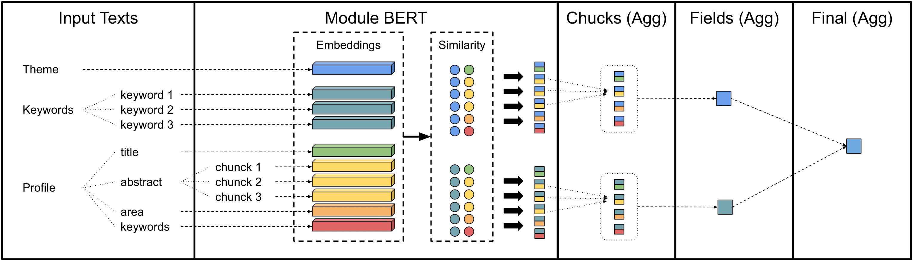
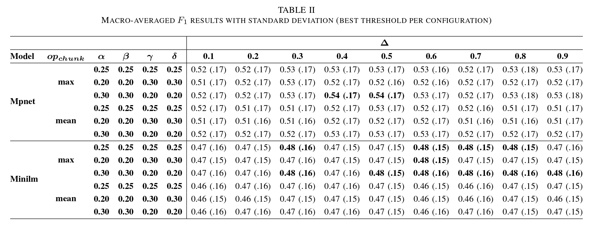
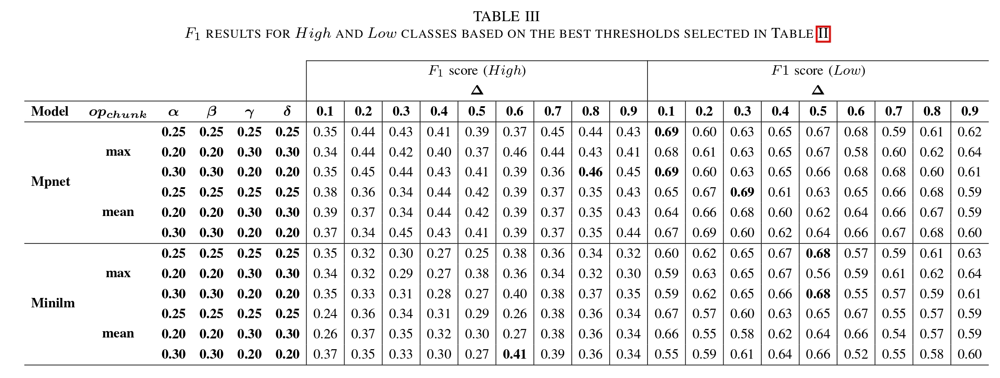

# Reducing Costs in Large-Scale Classification: A Hybrid BERT–LLM Strategy

- Augusto Cesar Dalal Miranda (FACOM/UFMS) | augusto.dalal@ufms.br
- Matheus Yasuo Ribeiro Utino (ICMC/USP) | matheusutino@usp.br
- Marcos Paulo Silva Gôlo (ICMC/USP) | marcosgolo@usp.br
- Marcela Aparecida Aniceto dos Santos (ICMC/USP) | marcelaaniceto@gmail.com
- Mariana Caravanti de Souza (FACOM/UFMS) | mariana.caravanti@usp.br 

# Abstract

The Brazilian National Graduate Education System (SNPG) faces the challenge of mapping thousands of researchers, such as master’s and doctoral degree holders and higher education teachers, with strong affinity to a set of strategic themes. In this context, Large Language Models (LLMs) have demonstrated high effectiveness in analyzing and classifying academic profiles, showing consistency in the identification of their areas of concentration. However, the large-scale application of such models entails substantial computational costs, specialized hardware requirements, and significant environmental impacts, such as increased carbon emissions. As an alternative, this work proposes a hybrid approach that combines a BERT-based pre-classification module with proprietary LLMs. We evaluate a BERT module that functions as a pre-filter, reducing the number of queries to LLMs by estimating the affinity between academic outputs and strategic themes, discarding those with low relevance. Affinity estimation is performed through embedding similarity measures. We use labeled data provided by the Workshop on Lightweight and Efficient Deep Learning in High-Performance Computing (LeanDL-HPC 2025) to propose and evaluate different strategies for aggregating information from academic profiles, computing their similarity with strategic themes. Results show that giving more weight to the title and abstract of academic outputs, aggregating embeddings with the max operator, and using the Mpnet model slightly improve performance.

Index Terms: Large Language Models, BERT-based models, Hybrid approach, Cost reduction, Pre-filter module.


# LeanDL-HPC 2025 Challenge

Details about the LeanDL-HPC 2025 challenge are available at the following links:

[LeanDL-HPC 2025 Workshop](https://sites.labic.icmc.usp.br/leandl2025/)

[Google Collab Notebook - About the LeanDL-HPC 2025 Workshop](https://colab.research.google.com/drive/1bJUCxDJ4Cmd2VLQp1-Wx2r_vSkYQUezT?usp=sharing#scrollTo=nph7MnuufZWQ)


# Original Datasets

The original datasets can be downloaded using `gdown` with the command below:
```
gdown 12H957uf6mK-1X_ztT9hgFS1slpN2j-Wh
gdown 1-QXkqH8HzLcV2JCA4Nm9G5rQhorYKJVe
```

# Four-Stage Affinity Filter Pipeline




# Results

## Macro-Averaged F1 Results With Standard Deviation 



## F1 Results For High And Low Classes




# Files Organization
- files/embedding_similarity: script used and data generated from processing the original dataset
- files/post-processing: tables and carbon emission logs obtained after post-processing the similarity results data

# References

[1]: CAPES. "História e missão." CAPES Official Website (Portal Gov.br), 2025. Accessed in August 2025. Available at: <https://www.gov.br/capes/pt-br/acesso-a-informacao/institucional/historia-e-missao>.

[2]: United Nations in Brazil. "Objetivos de desenvolvimento sustentável  no Brasil." 2025. Accessed in February 2025. Available at: <https://brasil.un.org/pt-br/sdgs>.

[3]: Yao, Y., Duan, J., Xu, K., Cai, Y., Sun, Z., Zhang, Y. "A survey on large language model (LLM) security and privacy: The good, the bad, and the ugly." High-Confidence Computing, vol. 4, no. 2, p. 100211, 2024.

[4]: Jiang, P., Sonne, C., Li, W., You, F., You, S. "Preventing the immense increase in the life-cycle energy and carbon footprints of LLM-powered intelligent chatbots." Engineering, vol. 40, pp. 202–210, 2024.

[5]: Shekhar, S., Dubey, T., Mukherjee, K., Saxena, A., Tyagi, A., Kotla, N. "Towards optimizing the costs of LLM usage." arXiv preprint arXiv:2402.01742, 2024.

[6]: Ding, D., Mallick, A., Wang, C., Sim, R., Mukherjee, S., Ruhle, V., Lakshmanan, L.V., Awadallah, A.H. "Hybrid LLM: Cost-efficient and quality-aware query routing." arXiv preprint arXiv:2404.14618, 2024.

[7]: Wang, W., Wei, F., Dong, L., Bao, H., Yang, N., Zhou, M. "MiniLM: Deep self-attention distillation for task-agnostic compression of pre-trained transformers." Advances in Neural Information Processing Systems, vol. 33, pp. 5776–5788, 2020.

[8]: Song, K., Tan, X., Qin, T., Lu, J., Liu, T.-Y. "MPNet: Masked and permuted pre-training for language understanding." Advances in Neural Information Processing Systems, vol. 33, pp. 16857–16867, 2020.

[9]: Chang, Y., Wang, X., Wang, J., Wu, Y., Yang, L., Zhu, K., Chen, H., Yi, X., Wang, C., Wang, Y. et al. "A survey on evaluation of large language models." ACM Transactions on Intelligent Systems and Technology, vol. 15, no. 3, pp. 1–45, 2024.

[10]: Bengio, Y., Ducharme, R., Vincent, P., Jauvin, C. "A neural probabilistic language model." Journal of Machine Learning Research, vol. 3, pp. 1137–1155, 2003.

[11]: Zhao, J., Huang, F., Lv, J., Duan, Y., Qin, Z., Li, G., Tian, G. "Do RNN and LSTM have long memory?" In: International Conference on Machine Learning. PMLR, 2020, pp. 11365–11375.

[12]: Vaswani, A., Shazeer, N., Parmar, N., Uszkoreit, J., Jones, L., Gomez, A.N., Kaiser, Ł., Polosukhin, I. "Attention is all you need." Advances in Neural Information Processing Systems, vol. 30, 2017.

[13]: Devlin, J., Chang, M.-W., Lee, K., Toutanova, K. "BERT: Pre-training of deep bidirectional transformers for language understanding." In: Proceedings of the 2019 Conference of the North American Chapter of the Association for Computational Linguistics: Human Language Technologies, Volume 1 (Long and Short Papers), 2019, pp. 4171–4186.

